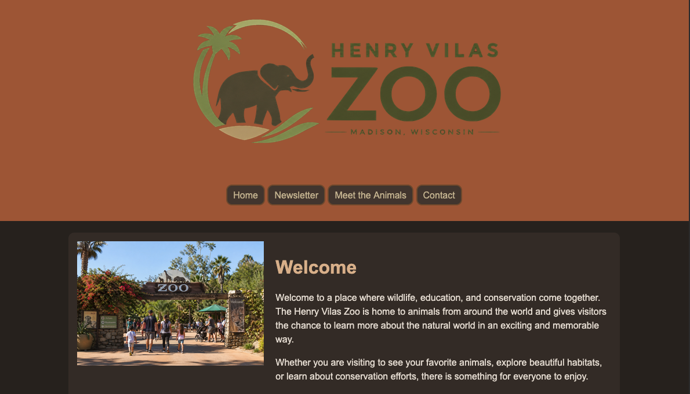
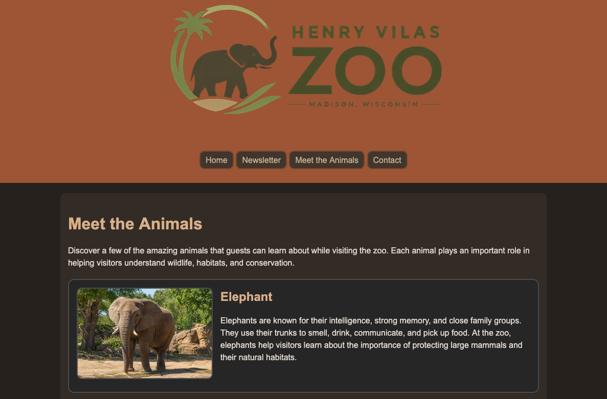
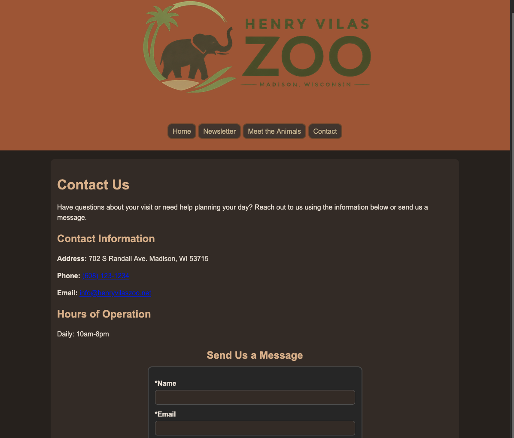

# Henry Vilas Zoo Website

A responsive multi-page zoo website created as part of a web development course and later expanded into a portfolio project. The site features a responsive layouts, form validation, and serverless form handling.

## Features

- Multi-page website
- Responsive design for desktop and mobile devices
- Client-side form validation
- Serverless form processing using Netlify Functions
- Accessible semantic HTML structure

## Technologies Used

- HTML5
- CSS3
- JavaScript
- Netlify Functions

## Screenshots

### Home Page



### Animals Page



### Form Page



## Running Locally

1. Clone the repository.
2. Open the project folder.
3. Run:

```bash
netlify dev
```

4. Open the local URL provided by Netlify.

## Project Structure

```text
.
├── index.html
├── animals.html
├── newsletter.html
├── contact.html
├── images/
├── stylesheets/
├── scripts/
└── netlify/
    └── functions/
        └── echo.js
```

## Notes

The original class project submitted forms to a school-hosted PHP server. This portfolio version replaces that functionality with a Netlify Function so the site can be fully deployed and demonstrated independently.
